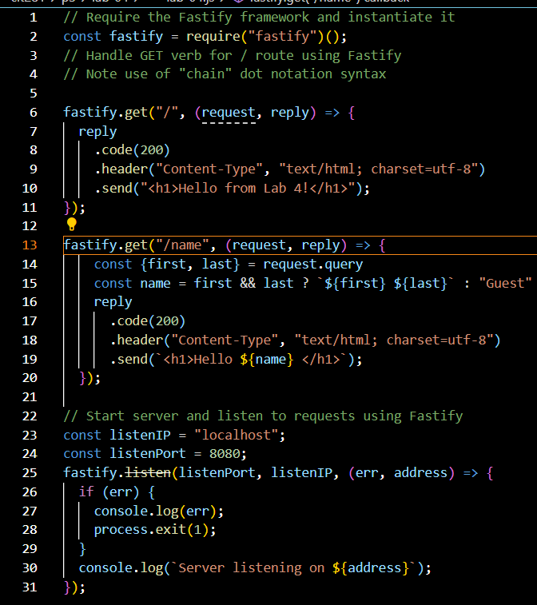

# Lab 4

## Purpose of the lab
In lab 4, I got experience creating initial Fastify Node.js web servers and adding routes with query parameters to handle the GET HTTP ver.

## Technologies used 
- Javascript
- VS Code
- Node.js
- npm
- Fastify

## What I learned from this Lab
During this lab, I learned...
- How to initialize a file as a Node.js project folder using Node Package Manager (npm)
- To fix MIME error
- To test files using npm in VS Code
- How to handle a GET HTTP verb
- More about server-side programming

